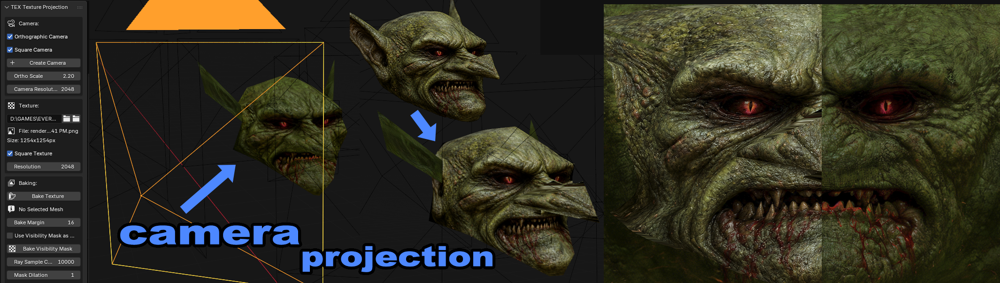
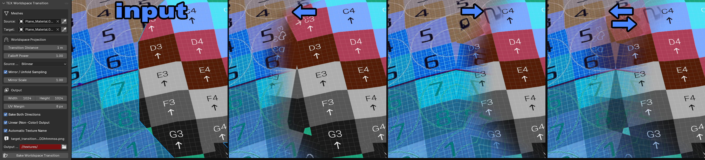
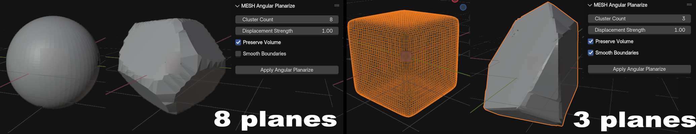
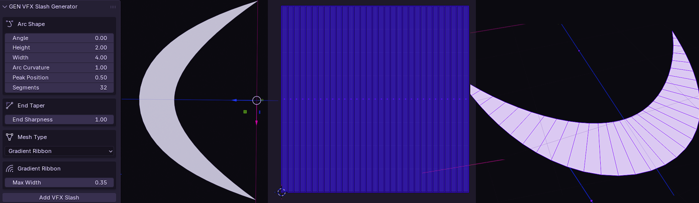
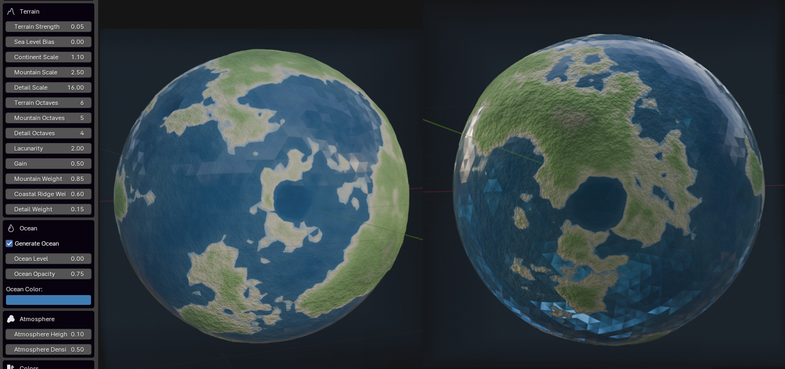
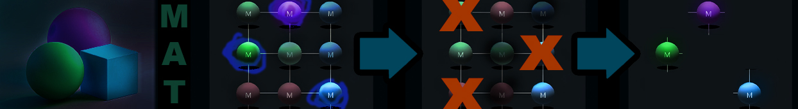
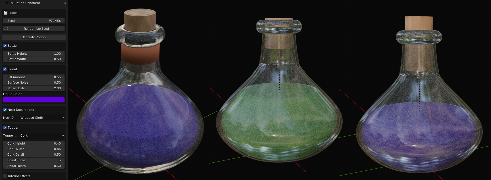
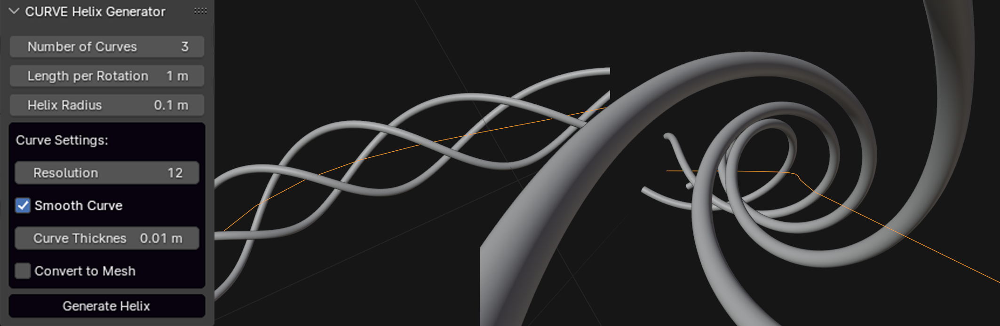

# ZENV BLENDER
blender addons focused on singular features of 3d modelling , materials , and textures

[DOWNLOAD]( https://github.com/CorvaeOboro/zenv_blender/archive/refs/heads/main.zip ) 

- each addon is self-contained and can be run independently
- many of the addons are work in progress

# INSTALL 
- download and extract folder to local filepath
- in Blender > Edit > Preferences > Addon > Install
- select the .py files in the extracted "addon" folder , then enable them with checkbox on  
- addons appear as side panel in upper right of View next to the gizmo there is a "<" arrow expand to see side panel tabs "ZENV"

# ADDONS

<table style="border-collapse: collapse; width: 100%; table-layout: fixed; word-break: break-word;">
  <tbody style="line-height: 1.1;">
    <!-- TEXTURE -->
    <tr><th colspan="4" align="left" style="padding: 2px 6px; background: #1f2430; color: #c8d3ff;">TEXTURE</th></tr>
    <tr style="vertical-align: top;">
      <td style="padding: 1px 6px; overflow-wrap: anywhere; word-break: break-word;"><a href="addon/z_blender_TEX_texture_proj_cam.py">texture proj cam</a></td>
      <td style="padding: 1px 6px; overflow-wrap: anywhere; word-break: break-word;"><a href="addon/z_blender_TEX_texture_variant_view.py">texture variant view</a></td>
      <td style="padding: 1px 6px; overflow-wrap: anywhere; word-break: break-word;"><a href="addon/z_blender_TEX_bake_ambient_occlusion_multi.py">bake ambient occlusion multi</a></td>
      <td style="padding: 1px 6px; overflow-wrap: anywhere; word-break: break-word;"><a href="addon/z_blender_TEX_bake_curvature_edge_highlight_multi.py">bake curvature edge highlight multi</a></td>
    </tr>
    <tr style="vertical-align: top;">
      <td style="padding: 1px 6px; overflow-wrap: anywhere; word-break: break-word;"><a href="addon/z_blender_TEX_bake_uv_island_facing_center_mask_multi.py">bake uv island facing center mask multi</a></td>
      <td style="padding: 1px 6px; overflow-wrap: anywhere; word-break: break-word;"><a href="addon/z_blender_TEX_bake_worldspace_bounds_gradient_multi.py">bake worldspace bounds gradient multi</a></td>
      <td style="padding: 1px 6px; overflow-wrap: anywhere; word-break: break-word;"><a href="addon/z_blender_TEX_texture_export_dated.py">texture export dated</a></td>
      <td style="padding: 1px 6px; overflow-wrap: anywhere; word-break: break-word;"><a href="addon/z_blender_TEX_transition_texture_worldspace_bake.py">transition texture worldspace bake</a></td>
    </tr>
    <!-- MESH -->
    <tr><th colspan="4" align="left" style="padding: 2px 6px; background: #1f2430; color: #c8d3ff;">MESH</th></tr>
    <tr style="vertical-align: top;">
      <td style="padding: 1px 6px; overflow-wrap: anywhere; word-break: break-word;"><a href="addon/z_blender_MESH_separate_by_material.py">separate by material</a></td>
      <td style="padding: 1px 6px; overflow-wrap: anywhere; word-break: break-word;"><a href="addon/z_blender_MESH_separate_by_UV_island.py">separate by UV island</a></td>
      <td style="padding: 1px 6px; overflow-wrap: anywhere; word-break: break-word;"><a href="addon/z_blender_MESH_separate_by_uv_quadrant.py">separate by uv quadrant</a></td>
      <td style="padding: 1px 6px; overflow-wrap: anywhere; word-break: break-word;"><a href="addon/z_blender_MESH_separate_by_axis.py">separate by axis</a></td>
    </tr>
    <tr style="vertical-align: top;">
      <td style="padding: 1px 6px; overflow-wrap: anywhere; word-break: break-word;"><a href="addon/z_blender_MESH_rename_objects_by_material.py">rename objects by material</a></td>
      <td style="padding: 1px 6px; overflow-wrap: anywhere; word-break: break-word;"><a href="addon/z_blender_MESH_noise_displace.py">noise displace</a></td>
      <td style="padding: 1px 6px; overflow-wrap: anywhere; word-break: break-word;"><a href="addon/z_blender_MESH_cut_world_bricker.py">cut world bricker</a></td>
      <td style="padding: 1px 6px; overflow-wrap: anywhere; word-break: break-word;"><a href="addon/z_blender_MESH_to_UV_space.py">to UV space</a></td>
    </tr>
    <tr style="vertical-align: top;">
      <td style="padding: 1px 6px; overflow-wrap: anywhere; word-break: break-word;"><a href="addon/z_blender_MESH_angular_planarize.py">angular planarize</a></td>
      <td style="padding: 1px 6px; overflow-wrap: anywhere; word-break: break-word;"><a href="addon/z_blender_MESH_merge_selected_to_new_collection.py">merge selected to new collection</a></td>
      <td style="padding: 1px 6px; overflow-wrap: anywhere; word-break: break-word;"></td>
      <td style="padding: 1px 6px; overflow-wrap: anywhere; word-break: break-word;"></td>
    </tr>
    <!-- GENERATIVE -->
    <tr><th colspan="4" align="left" style="padding: 2px 6px; background: #1f2430; color: #c8d3ff;">GENERATIVE</th></tr>
    <tr style="vertical-align: top;">
      <td style="padding: 1px 6px; overflow-wrap: anywhere; word-break: break-word;"><a href="addon/z_blender_GEN_tiles_from_textures.py">tiles from textures</a></td>
      <td style="padding: 1px 6px; overflow-wrap: anywhere; word-break: break-word;"><a href="addon/z_blender_GEN_ultima_landtiles.py">ultima landtiles</a></td>
      <td style="padding: 1px 6px; overflow-wrap: anywhere; word-break: break-word;"><a href="addon/z_blender_GEN_vfx_slash.py">vfx slash</a></td>
      <td style="padding: 1px 6px; overflow-wrap: anywhere; word-break: break-word;"><a href="addon/z_blender_GEN_planet_procedural.py">planet procedural</a></td>
    </tr>
    <!-- MATERIAL -->
    <tr><th colspan="4" align="left" style="padding: 2px 6px; background: #1f2430; color: #c8d3ff;">MATERIAL</th></tr>
    <tr style="vertical-align: top;">
      <td style="padding: 1px 6px; overflow-wrap: anywhere; word-break: break-word;"><a href="addon/z_blender_MAT_remove_unused_materials.py">remove unused materials</a></td>
      <td style="padding: 1px 6px; overflow-wrap: anywhere; word-break: break-word;"><a href="addon/z_blender_MAT_consolidate_duplicate_mats.py">consolidate duplicate mats</a></td>
      <td style="padding: 1px 6px; overflow-wrap: anywhere; word-break: break-word;"><a href="addon/z_blender_MAT_rename_material_by_texture.py">rename material by texture</a></td>
      <td style="padding: 1px 6px; overflow-wrap: anywhere; word-break: break-word;"><a href="addon/z_blender_MAT_rename_material_suffix.py">rename material suffix</a></td>
    </tr>
    <tr style="vertical-align: top;">
      <td style="padding: 1px 6px; overflow-wrap: anywhere; word-break: break-word;"><a href="addon/z_blender_MAT_remove_all_opacity.py">remove all opacity</a></td>
      <td style="padding: 1px 6px; overflow-wrap: anywhere; word-break: break-word;"><a href="addon/z_blender_MAT_create_from_textures.py">create from textures</a></td>
      <td style="padding: 1px 6px; overflow-wrap: anywhere; word-break: break-word;"><a href="addon/z_blender_MAT_unlit_convert.py">unlit convert</a></td>
      <td style="padding: 1px 6px; overflow-wrap: anywhere; word-break: break-word;"><a href="addon/z_blender_MAT_remap_textures.py">remap textures</a></td>
    </tr>
    <tr style="vertical-align: top;">
      <td style="padding: 1px 6px; overflow-wrap: anywhere; word-break: break-word;"><a href="addon/z_blender_MAT_set_textures_by_material_name.py">set textures by material name</a></td>
      <td style="padding: 1px 6px; overflow-wrap: anywhere; word-break: break-word;"></td>
      <td style="padding: 1px 6px; overflow-wrap: anywhere; word-break: break-word;"></td>
      <td style="padding: 1px 6px; overflow-wrap: anywhere; word-break: break-word;"></td>
    </tr>
    <!-- EXPORT -->
    <tr><th colspan="4" align="left" style="padding: 2px 6px; background: #1f2430; color: #c8d3ff;">EXPORT</th></tr>
    <tr style="vertical-align: top;">
      <td style="padding: 1px 6px; overflow-wrap: anywhere; word-break: break-word;"><a href="addon/z_blender_EXPORT_all_objects_to_separate_blend.py">export all objects to separate blend</a></td>
      <td style="padding: 1px 6px; overflow-wrap: anywhere; word-break: break-word;"><a href="addon/z_blender_EXPORT_all_objects_to_separate_fbx.py">export all objects to separate fbx</a></td>
      <td style="padding: 1px 6px; overflow-wrap: anywhere; word-break: break-word;"></td>
      <td style="padding: 1px 6px; overflow-wrap: anywhere; word-break: break-word;"></td>
    </tr>
    <!-- ITEM -->
    <tr><th colspan="4" align="left" style="padding: 2px 6px; background: #1f2430; color: #c8d3ff;">ITEM</th></tr>
    <tr style="vertical-align: top;">
      <td style="padding: 1px 6px; overflow-wrap: anywhere; word-break: break-word;"><a href="addon/z_blender_ITEM_potion.py">potion</a></td>
      <td style="padding: 1px 6px; overflow-wrap: anywhere; word-break: break-word;"></td>
      <td style="padding: 1px 6px; overflow-wrap: anywhere; word-break: break-word;"></td>
      <td style="padding: 1px 6px; overflow-wrap: anywhere; word-break: break-word;"></td>
    </tr>
    <!-- VIEW -->
    <tr><th colspan="4" align="left" style="padding: 2px 6px; background: #1f2430; color: #c8d3ff;">VIEW</th></tr>
    <tr style="vertical-align: top;">
      <td style="padding: 1px 6px; overflow-wrap: anywhere; word-break: break-word;"><a href="addon/z_blender_VIEW_view_flat_color_texture.py">view flat color texture</a></td>
      <td style="padding: 1px 6px; overflow-wrap: anywhere; word-break: break-word;"><a href="addon/z_blender_VIEW_view_scale_clipping.py">view scale clipping</a></td>
      <td style="padding: 1px 6px; overflow-wrap: anywhere; word-break: break-word;"><a href="addon/z_blender_VIEW_skeleton_display.py">skeleton display</a></td>
      <td style="padding: 1px 6px; overflow-wrap: anywhere; word-break: break-word;"></td>
    </tr>
    <!-- UV -->
    <tr><th colspan="4" align="left" style="padding: 2px 6px; background: #1f2430; color: #c8d3ff;">UV</th></tr>
    <tr style="vertical-align: top;">
      <td style="padding: 1px 6px; overflow-wrap: anywhere; word-break: break-word;"><a href="addon/z_blender_UV_uv_mirror_zero_pivot.py">uv mirror zero pivot</a></td>
      <td style="padding: 1px 6px; overflow-wrap: anywhere; word-break: break-word;"><a href="addon/z_blender_UV_optimize_islands.py">optimize islands</a></td>
      <td style="padding: 1px 6px; overflow-wrap: anywhere; word-break: break-word;"></td>
      <td style="padding: 1px 6px; overflow-wrap: anywhere; word-break: break-word;"></td>
    </tr>
    <!-- RENDER -->
    <tr><th colspan="4" align="left" style="padding: 2px 6px; background: #1f2430; color: #c8d3ff;">RENDER</th></tr>
    <tr style="vertical-align: top;">
      <td style="padding: 1px 6px; overflow-wrap: anywhere; word-break: break-word;"><a href="addon/z_blender_RENDER_color.py">color</a></td>
      <td style="padding: 1px 6px; overflow-wrap: anywhere; word-break: break-word;"><a href="addon/z_blender_RENDER_depth.py">depth</a></td>
      <td style="padding: 1px 6px; overflow-wrap: anywhere; word-break: break-word;"></td>
      <td style="padding: 1px 6px; overflow-wrap: anywhere; word-break: break-word;"></td>
    </tr>
    <!-- CLEAN -->
    <tr><th colspan="4" align="left" style="padding: 2px 6px; background: #1f2430; color: #c8d3ff;">CLEAN</th></tr>
    <tr style="vertical-align: top;">
      <td style="padding: 1px 6px; overflow-wrap: anywhere; word-break: break-word;"><a href="addon/z_blender_CLEAN_scene_optimizer.py">scene optimizer</a></td>
      <td style="padding: 1px 6px; overflow-wrap: anywhere; word-break: break-word;"></td>
      <td style="padding: 1px 6px; overflow-wrap: anywhere; word-break: break-word;"></td>
      <td style="padding: 1px 6px; overflow-wrap: anywhere; word-break: break-word;"></td>
    </tr>
    <!-- CURVE -->
    <tr><th colspan="4" align="left" style="padding: 2px 6px; background: #1f2430; color: #c8d3ff;">CURVE</th></tr>
    <tr style="vertical-align: top;">
      <td style="padding: 1px 6px; overflow-wrap: anywhere; word-break: break-word;"><a href="addon/z_blender_CURVE_helix_along_curve.py">helix along curve</a></td>
      <td style="padding: 1px 6px; overflow-wrap: anywhere; word-break: break-word;"></td>
      <td style="padding: 1px 6px; overflow-wrap: anywhere; word-break: break-word;"></td>
      <td style="padding: 1px 6px; overflow-wrap: anywhere; word-break: break-word;"></td>
    </tr>
  </tbody>
</table>

## TEXTURE
- [texture_proj_cam](addon/z_blender_TEX_texture_proj_cam.py) - texture projection from camera - creates square orthographic camera from current view , and the camera projects image onto mesh baking to texture . workflow similar to "quick edits" in texture paint mode , now with permanent cameras
- 
- [texture_variant_view](addon/z_blender_TEX_texture_variant_view.py) - specify a folder of textures , then with a mesh selected can quickly cycle through them applied to the mesh , ranking them into subfolders . useful for visualizing and choosing the best from many synthesized texture variants
- [bake_ambient_occlusion_multi](addon/z_blender_TEX_bake_ambient_occlusion_multi.py) - bake AO to texture , selected temp merge
- [bake_curvature_edge_highlight_multi](addon/z_blender_TEX_bake_curvature_edge_highlight_multi.py) - bake Curvature to texture , selected temp merge
- [bake_uv_island_facing_center_mask_multi](addon/z_blender_TEX_bake_uv_island_facing_center_mask_multi.py) - per UV island pick 1 face facing a center point; bake mask via EMIT
- [bake_worldspace_bounds_gradient_multi](addon/z_blender_TEX_bake_worldspace_bounds_gradient_multi.py) - multi-object worldspace gradients bake (XYZ RGB or vertical grayscale)
- [texture_export_dated](addon/z_blender_TEX_texture_export_dated.py) - Export painted textures to dated copies inside the matching project folder
- [transition_texture_worldspace_bake](addon/z_blender_TEX_transition_texture_worldspace_bake.py) - bake worldspace transition texture between two meshes
- 

## MESH
- [separate_by_material](addon/z_blender_MESH_separate_by_material.py) - for each material detach mesh into parts 
- [separate_by_UV_island](addon/z_blender_MESH_separate_by_UV_island.py) - for each uv island detach mesh into parts
- [separate_by_uv_quadrant](addon/z_blender_MESH_separate_by_uv_quadrant.py) - split mesh along UV seams and transform
- [separate_by_axis](addon/z_blender_MESH_separate_by_axis.py) - separate mesh parts by axis
- [rename_objects_by_material](addon/z_blender_MESH_rename_objects_by_material.py) - rename objects by material name
- [noise_displace](addon/z_blender_MESH_noise_displace.py) - 3D noise-based surface displacement with presets
- [cut_world_bricker](addon/z_blender_MESH_cut_world_bricker.py) - Cut mesh into brick like segments
- [to_UV_space](addon/z_blender_MESH_to_UV_space.py) - transform mesh to match UV layout in 3D space
- [angular_planarize](addon/z_blender_MESH_angular_planarize.py) - planarize mesh faces by random k-means angle cluster , useful for rock like sharpening with flat areas
- 
- [merge_selected_to_new_collection](addon/z_blender_MESH_merge_selected_to_new_collection.py) - duplicate selected meshes, join duplicates into one object in a new collection

## GENERATIVE
- [tiles_from_textures](addon/z_blender_GEN_tiles_from_textures.py) - generate random tiles from texture set for tiling and seam blending review
- [ultima_landtiles](addon/z_blender_GEN_ultima_landtiles.py) - generate landtiles from ultima online map mul exported csv data of xyz and id
- [vfx_slash](addon/z_blender_GEN_vfx_slash.py) - generate parabola based slash mesh effects
- 
- [planet_procedural](addon/z_blender_GEN_planet_procedural.py) - generate procedural planets with layered terrain
- 

## MATERIAL
- [remove_unused_materials](addon/z_blender_MAT_remove_unused_materials.py) - remove unused materials
- 
- [consolidate_duplicate_mats](addon/z_blender_MAT_consolidate_duplicate_mats.py) - reduce to one material per texture
- [rename_material_by_texture](addon/z_blender_MAT_rename_material_by_texture.py) - rename material by texture name
- [rename_material_suffix](addon/z_blender_MAT_rename_material_suffix.py) - add or remove prefix or suffix on materials
- [remove_all_opacity](addon/z_blender_MAT_remove_all_opacity.py) - remove all opacity textures in materials
- [create_from_textures](addon/z_blender_MAT_create_from_textures.py) - create materials from texture folder
- [unlit_convert](addon/z_blender_MAT_unlit_convert.py) - convert all materials to emission for unlit render
- [remap_textures](addon/z_blender_MAT_remap_textures.py) - remap texture paths in materials
- [set_textures_by_material_name](addon/z_blender_MAT_set_textures_by_material_name.py) - assign textures based on material names

## EXPORT
- [export_all_objects_to_separate_blend](addon/z_blender_EXPORT_all_objects_to_separate_blend.py) - batch export selected objects to separate blend files
- [export_all_objects_to_separate_fbx](addon/z_blender_EXPORT_all_objects_to_separate_fbx.py) - batch export selected objects to separate FBX files

## ITEM
- [potion](addon/z_blender_ITEM_potion.py) - generate potion bottle mesh and material
- 

## VIEW 
- [view_flat_color_texture](addon/z_blender_VIEW_view_flat_color_texture.py) - quickview flat color texture , unlit viewmode
- [view_scale_clipping](addon/z_blender_VIEW_view_scale_clipping.py) - uses bounds of objects in scene to set near and far clipping
- [skeleton_display](addon/z_blender_VIEW_skeleton_display.py) - GPU overlay rendering bones as spheres with parent-child connection lines

## UV
- [uv_mirror_zero_pivot](addon/z_blender_UV_uv_mirror_zero_pivot.py) - U or V mirroring with pivot always at zero instead of the default of selected center
- [optimize_islands](addon/z_blender_UV_optimize_islands.py) - Snap UV islands toward origin

## RENDER
- [color](addon/z_blender_RENDER_color.py) - quick renders color unlit image with datetime suffix
- [depth](addon/z_blender_RENDER_depth.py) - renders depth with auto min max from selected object with datetime suffix

## CLEAN
- [scene_optimizer](addon/z_blender_CLEAN_scene_optimizer.py) - optimize removing unused material , textures , and mesh data

## CURVE
- [helix_along_curve](addon/z_blender_CURVE_helix_along_curve.py) - generate helical curves that follow a base curve
- 

# EXAMPLE WORKFLOWS
- DIFFUSION CAMERA PROJECTION TEXTURING = [texture_proj_cam](addon/z_blender_TEX_texture_proj_cam.py) creates a square camera from view > [render_color_and_depth](addon/z_blender_RENDER_color_and_depth.py) renders color and depth images > img2img diffusion ( stable diffuson ) > [texture_proj_cam](addon/z_blender_TEX_texture_proj_cam.py) bakes texture projection from camera
- ZONE MESH SEPARATION = import mesh > consolidate materials > separate mesh by material > rename meshes by material name > rename materials with _MI suffix > export all to blends

# LICENSE
- free to all , [creative commons CC0 1.0](https://creativecommons.org/publicdomain/zero/1.0/) , free to re-distribute , attribution not required
